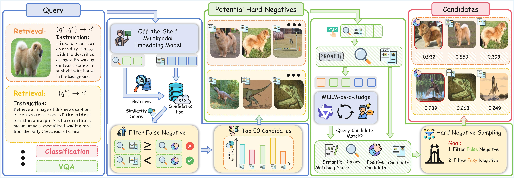
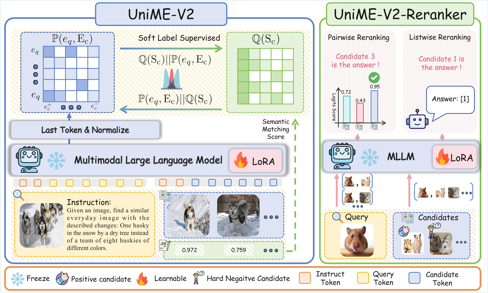
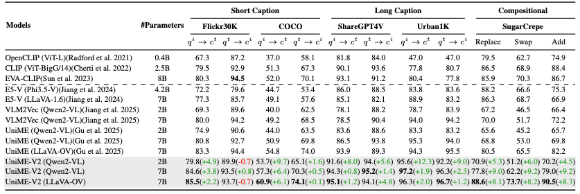
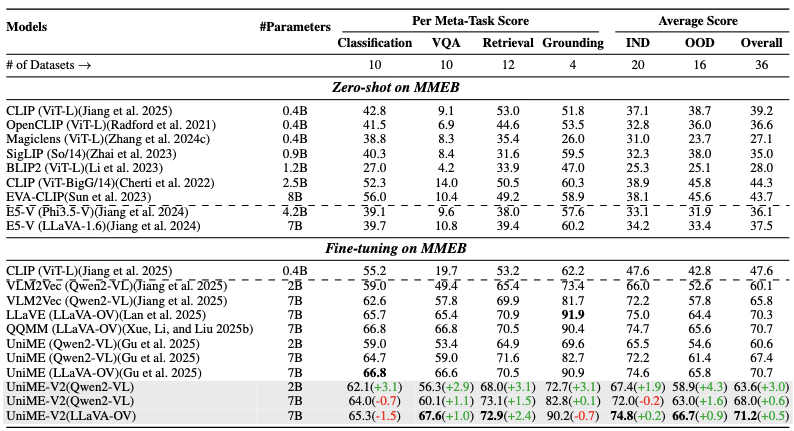

<div align="center">

# UniME-V2: MLLM-as-a-Judge for Universal Multimodal Embedding Learning

<a href="https://scholar.google.com/citations?hl=zh-CN&user=9etrpbYAAAAJ">Tiancheng Gu*</a>,</span>
<a href="https://kaicheng-yang0828.github.io">Kaicheng Yang*</a>,</span>
<a href="https://kcz358.github.io/">kaichen Zhang</a>,</span>
<a href="https://scholar.google.com/citations?hl=zh-CN&user=1ckaPgwAAAAJ">Xiang An</a>,</span>
Ziyong Feng,</span> \
<a href="https://scholar.google.com/citations?hl=en&user=LatWlFAAAAAJ">Yueyi Zhang</a>,</span>
<a href="https://weidong-tom-cai.github.io">Weidong Cai</a>,</span>
<a href="https://jiankangdeng.github.io">Jiankang Deng</a>,</span>
<a href="https://lidongbing.github.io">Lidong Bing</a></span>

[]()
[]()
[](https://huggingface.co/collections/TianchengGu/unime-v2-68ef708ac48066353b4a0806)
[](https://huggingface.co/datasets/TianchengGu/UniME-V2-Training-Datasets)
</div>

## 📢 Latest News
<!-- - `2025/10/15`: ✨The paper of UniME-v2 is submitted to [📄 arxiv](). -->
- `2025/10/15`: ✨We release the model, data in [🤗 Huggingface](https://huggingface.co/collections/TianchengGu/unime-v2-68ef708ac48066353b4a0806)
- `2025/10/15`: ✨We release the evaluation, training and demo code.

## 🎨 In-Progress
- [ ] Release the paper of UniME-v2
- [x] Release data and model weight.
- [x] Release the evaluation scripts.
- [x] Release the training code.


## 💡 Highlights
- We introduce an MLLM-as-a-Judge pipeline for hard negative mining that uses the advanced understanding capabilities of MLLM to assess the semantic alignment of each query-candidate pair within a globally retrieved potential hard negative set.

<div align="center">
  
</div>

- We present UniME-V2, a novel universal multimodal embedding model trained with an MLLM judgment based distribution alignment framework. By leveraging semantic matching scores as soft labels, the model effectively captures semantic differences between candidates, significantly enhancing its discriminative capability. Meanwhile, we propose UniME-V2-Reranker, a reranking model trained on high-quality, diverse hard negatives through a joint pairwise and listwise optimization approach.

<div align="center">
  
</div>

## 🛠️ Implementation

### 📦 Enviroment
```bash
conda create -n uniMEv2 python=3.10 -y
conda activate uniMEv2
pip install -r requirements.txt

# Optional: Install Flash Attention for acceleration
# wget https://github.com/Dao-AILab/flash-attention/releases/download/v2.7.4.post1/flash_attn-2.7.4.post1+cu12torch2.4cxx11abiFALSE-cp310-cp310-linux_x86_64.whl
# pip install flash_attn-2.7.4.post1+cu12torch2.4cxx11abiFALSE-cp310-cp310-linux_x86_64.whl
```

### 📊 Data Download
```bash
# hep download data, Just reference, please download and correct them by yourself
cd data

# Download evaluation data
bash eval_data_download.sh

# Download training data 
bash training_data_download.sh

# Download models

```

### 🗂️ Dataset Structure
```bash
data
  |-- MMEB_eval
  |-- MMEB_train
  |-- Urban1k
  |-- coco_test
  |-- sugar-crepe
  |-- shareGPT4v
  |-- flickr30k_test
  |-- example_data.json
  |-- train_data_InternVL3_14B_scores.json
  |-- train_data_InternVL3_8B_scores.json
  |-- train_data_Qwen25VL_7B_scores.json
  |-- hfd.sh # for accelerate download
  |-- eval_data_download.sh
  |-- training_data_download.sh
```

### 🗃️  Model Structure
```bash
models
    |-- UniME-V2_LLaVA_onevision_8B
    |-- UniME-V2_qwen2VL_2B
    |-- UniME-V2_qwen2VL_7B
    |-- UniME-v2-rerank_qwen25VL_7B
    |-- hfd.sh # for accelerate download
```

## 🏋️ Training && Evaluation
### 🔍 Embedding model
```bash
cd Embedding
# Training
bash shells/training/train_qwen2vl.sh # qwen2VL 2B or 7B
bash shells/training/train_llavaOV.sh # LLaVA-onevision 8B
# Testing
# Choose to do: Edit data path in Embedding/evaluation/utils/data_path.py
bash shells/testing_embedding/test_UniMEv2_qwen2vl_2B.sh
bash shells/testing_embedding/test_UniMEv2_qwen2vl_7B.sh
bash shells/testing_embedding/test_UniMEv2_llavaOV_8B.sh
```

### 🎯 Rerank model
```bash
# Training
cd Rerank
bahs scripts/train_qwen25VL_7B.sh
# Testing
cd ../Embedding
bash shells/testing_rerank/test_qwen25VL_7B_full_emb2B.sh # rerank after UniME-v2(qwen2VL-2B)
bash shells/testing_rerank/test_qwen25VL_7B_full_emb7B.sh # rerank after UniME-v2(qwen2VL-7B)
```

### 📈 Eval Result Structure
```bash
|-- MMEB_eval # Embedding: MMEB intermediate results for analysis
|   |-- A-OKVQA_pred.txt
|   |-- A-OKVQA_qry
|   |-- A-OKVQA_rerank_topk.json
|   |-- A-OKVQA_score.json
|   |-- A-OKVQA_tgt
|-- MMEB_eval_conclude # Embedding: MMEB statistics results
|   `-- MMEB_eval_conclude.txt
|-- UniME-V2-rerank_qwen25VL_7B # Rerank: MMEB intermediate results for analysis
|   |-- A-OKVQA_rerank_scores
|   |-- A-OKVQA_rerank_scores_final.json
|-- UniME-V2-rerank_qwen25VL_7B_conclude # Rerank: MMEB statistics results
|   `-- MMEB_eval_conclude.txt
|-- Urban200K
|   |-- Urban200K_image
|   |-- Urban200K_image2text_rerank
|   |-- Urban200K_image2text_rerank.json # Embedding:  Urban200K I2T statistics results
|   |-- Urban200K_text
|   |-- Urban200K_text2image_rerank
|   |-- Urban200K_text2image_rerank.json # Rerank:  Urban200K T2I statistics results
|   |-- recall_results.txt
|   `-- rerank_top10.pt
|-- coco2014
|-- flickr30k
|-- sharegpt4v
`-- sugarcrepe
    |-- add_att_image
    |-- add_att_rerank
    |-- add_att_text_neg
    |-- add_att_text_pos
    |-- add_obj_image
    |-- add_obj_text_neg
    |-- add_obj_text_pos
    |-- recall_results.txt # Embedding:  sugarcrepe statistics results
    |-- add_obj_rerank
    |-- recall_results_rerank.txt # Rerank:  sugarcrepe statistics results
```

## 🚀 Quick Start
```bash
git clone https://github.com/deepglint/UniME-v2.git
cd UniME-v2
```
### 🔍 Embedding model & Rerank model
```python
import torch
from torch.nn import functional as F
from utils.utils import init_model_and_processor, prepare_stage_data, parse_answer_index

device="cuda"
embedding=False # adjust embedding model or rerank model
if embedding:
    model_name="models/UniME-V2_qwen2VL_2B"
    # model_name="models/UniME-V2_qwen2VL_7B"
    # model_name="models/UniME-V2_LLaVA_onevision_8B"
    text = "A man is crossing the street with a red car parked nearby."
    image_path = "Figures/demo.png"
else:
    model_name="models/UniME-v2-rerank_qwen25VL_7B"
    text = ["A man is crossing the street with a red car parked nearby.",  #! Target text
            "A woman is walking her dog with a blue bicycle leaning nearby.",
            "A child is riding a scooter past a green truck stopped nearby.",
            "A couple is waiting for the bus beside a yellow taxi parked nearby.",
            "A jogger is running along the path with a black motorcycle parked nearby."]
    image_path = "Figures/demo.png"

model, processor = init_model_and_processor(model_name, device, embedding=embedding)

if embedding:
    inputs_image, inputs_txt = prepare_stage_data(model_name, processor, text, image_path, embedding=embedding)
    inputs_image = {k: v.to(device) if isinstance(v, torch.Tensor) else v for k, v in inputs_image.items()}
    inputs_txt = {k: v.to(device) if isinstance(v, torch.Tensor) else v for k, v in inputs_txt.items()}
    with torch.no_grad():
        emb_text = model(**inputs_txt, output_hidden_states=True, return_dict=True).hidden_states[-1][:, -1, :]
        emb_image = model(**inputs_image, output_hidden_states=True, return_dict=True).hidden_states[-1][:, -1, :]
        emb_text = F.normalize(emb_text, dim=-1)
        emb_image = F.normalize(emb_image, dim=-1)
        Score = emb_image @ emb_text.T
        print("Score: ", Score.item()) # qwen2VL 2B : Score: 0.62109375
else:
    inputs = prepare_stage_data(model_name, processor, text, image_path, embedding=embedding)
    inputs = {k: v.to(device) if isinstance(v, torch.Tensor) else v for k, v in inputs.items()}
    with torch.no_grad():
        generated_ids = model.generate(**inputs, max_new_tokens=128, output_scores=True, return_dict_in_generate=True, do_sample=False).sequences
    generated_ids_trimmed = [
        out_ids[len(in_ids) :] for in_ids, out_ids in zip(inputs['input_ids'], generated_ids)
    ]
    output_text = processor.batch_decode(
        generated_ids_trimmed, skip_special_tokens=True, clean_up_tokenization_spaces=False
    )
    print("Rerank Answer: ", parse_answer_index(output_text[0])) # qwen25VL 7B: Rerank Answer: 0
```

## 📊 Results

### 🌈 Diversity Retrieval
<div align="center">
  
</div>


### 🏆 MMEB
<div align="center">
  
</div>

## 💬 Support
| Team Member | Email |
|-------------|-------|
| **Tiancheng Gu** | [](mailto:gtcivy01@outlook.com) | 
| **Kaicheng Yang** | [](mailto:kaichengyang@deepglint.com) |


## 👏 Acknowledgements
Many thanks to the code bases from 
* [VLM2VEC](https://github.com/TIGER-AI-Lab/VLM2Vec)
* [LamRA](https://github.com/Code-kunkun/LamRA)
* [ms-swift](https://github.com/modelscope/ms-swift)
* [sugar-crepe](https://github.com/RAIVNLab/sugar-crepe)
* [LongCLIP](https://github.com/beichenzbc/Long-CLIP#evaluation)
* [tevatron](https://github.com/texttron/tevatron)
* [lmms-finetune](https://github.com/zjysteven/lmms-finetune)
* [UniME](https://github.com/deepglint/UniME)


## 🖊️ Citation
If you find this repository useful, please use the following BibTeX entry for citation.
```latex
Coming Soon !!!

@misc{gu2025unime,
      title={Breaking the Modality Barrier: Universal Embedding Learning with Multimodal LLMs}, 
      author={Tiancheng Gu and Kaicheng Yang and Ziyong Feng and Xingjun Wang and Yanzhao Zhang and Dingkun Long and Yingda Chen and Weidong Cai and Jiankang Deng},
      year={2025},
      eprint={2504.17432},
      archivePrefix={arXiv},
      primaryClass={cs.CV},
      url={https://arxiv.org/abs/2504.17432}, 
}

```

<div align="center">
⭐ Don't forget to star this repository if you find it helpful!

</div>
